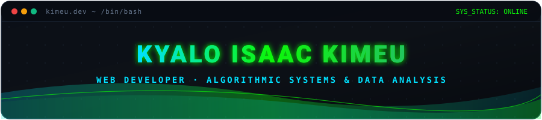

  

   

---

## 👋 About Me

- **Name:** Kyalo Isaac Kimeu  
- **Location:** Nairobi, Kenya 🇰🇪  
- **Role:** Web Developer · Algorithms & Data Systems  
- **Contact:** [ikyalokimeu@gmail.com](mailto:ikyalokimeu@gmail.com)

I build responsive web applications from requirements to deployment, with a focus on reliable data systems, real-time features, and practical AI integration.

## 🚀 What I Build

- 🌐 End-to-end web systems (planning, implementation, deployment, handover)
- 📍 Real-time + geolocation features for live user experiences
- 🗄️ Relational data models optimized for performance and integrity
- 🤖 AI/ML integration inside production-ready applications
- 🐳 Docker-based deployment pipelines

## 🧠 Current Focus

- **Primary:** Python & C++ for algorithmic systems
- **Secondary:** High-frequency decision-making workflows
- **Exploring:** Data analysis and applied ML tooling

## 🛠️ Tech Stack

## 📊 GitHub Stats

  <table>
    <tr>
      <td width="50%">
        
      </td>
      <td width="50%">
        
      </td>
    </tr>
  </table>

  

## 🤝 Connect

---

  

